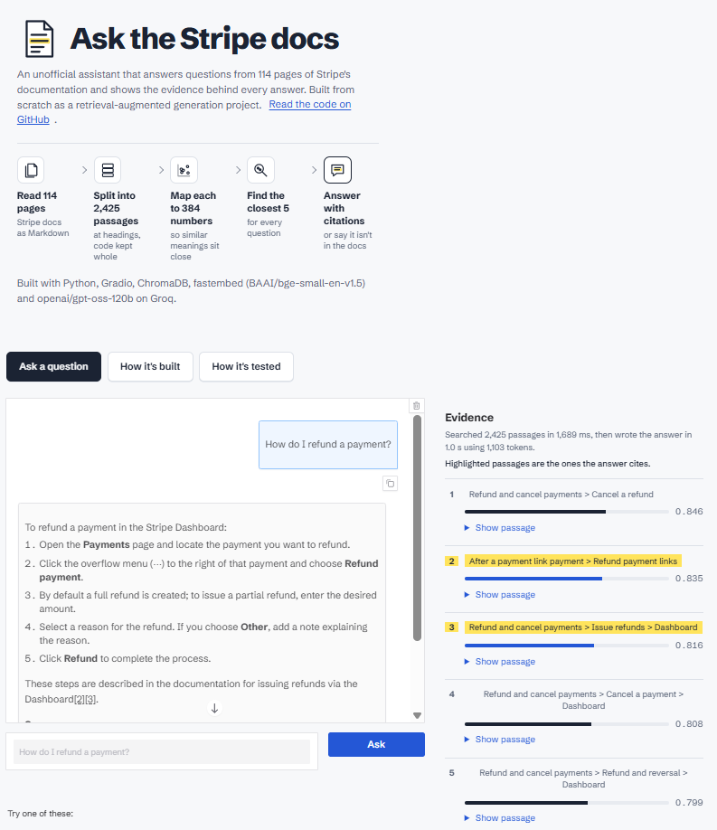
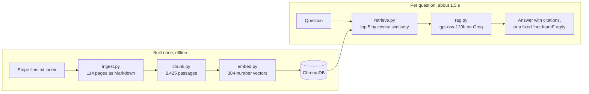

# Ask the Stripe docs

A retrieval-augmented generation (RAG) assistant that answers developer questions from Stripe's documentation, cites the exact pages it used, and says so when the docs don't cover a question. Every answer comes with the evidence behind it: the passages the model saw, how closely each matched, and which ones it cited.

**[Try the live demo →](https://stripe-docs-rag.onrender.com/)**



> Unofficial project, not affiliated with or endorsed by Stripe. Answers can be wrong; check the linked sources.

## Results

Measured on 28 questions with known answers ([`eval/questions.json`](eval/questions.json)): 20 direct questions, 4 written casually, and 4 the docs can't answer. Full per-question results are in [`eval/results.json`](eval/results.json) and on the app's "How it's tested" tab.

| What's measured | Result |
|---|---|
| Right page retrieved in the top 5 (direct questions) | **100%** |
| Right page retrieved in the top 5 (casual phrasing) | **75%** |
| Mean reciprocal rank (1.0 = right page always ranked first) | **0.94** |
| Claims in answers supported by the retrieved sources | **96.8%** |
| Answers with every claim supported | **22 of 24** |
| Off-topic questions correctly declined | **4 of 4** |
| Answerable questions wrongly declined | **0 of 24** |
| Median time to answer | **1.4 s** |

Faithfulness is graded by a second model (LLM-as-judge) that lists every claim and code sample in an answer and checks each one against the passages.

## How it works



1. **Ingest** ([`ingest.py`](ingest.py)): downloads the Payments, Checkout and Billing sections of the docs as Markdown, using the `llms.txt` index Stripe publishes for AI tools.
2. **Chunk** ([`chunk.py`](chunk.py)): splits pages at their headings, packs paragraphs into passages of up to 1,200 characters, keeps code blocks whole, and starts each passage with its heading path (for example `Refund and cancel payments > Issue refunds`) so it makes sense on its own.
3. **Embed** ([`embed.py`](embed.py)): turns each passage into a vector with `BAAI/bge-small-en-v1.5` and stores it in ChromaDB.
4. **Retrieve** ([`retrieve.py`](retrieve.py)): embeds the question the same way and returns the 5 closest passages.
5. **Generate** ([`rag.py`](rag.py)): asks the LLM to answer only from those passages and cite each fact, with a fixed sentence for questions they don't answer.

## Design decisions

- **Inspected the data before trusting it.** 28 of the 114 downloaded pages turned out to be empty index stubs pointing to page variants (hosted vs. embedded Checkout, Dashboard vs. API). Ingestion detects them and fetches the real content, which added 360 passages.
- **Structure-aware chunking instead of fixed-size windows.** Splitting at headings keeps related information together. The chunker tracks code fences, because a line like `# Install the CLI` inside a code block is a comment, not a heading; 38 such lines would otherwise have split code samples in half.
- **Heading breadcrumbs instead of chunk overlap.** Each passage carries its own context, so even a bare table of test bank numbers is findable from its breadcrumb.
- **Asymmetric query prefix.** BGE models expect an instruction in front of search queries but not in front of documents, because questions and answers are phrased differently. The prefix is defined once in [`config.py`](config.py) and shared by indexing and search.
- **fastembed (ONNX) instead of sentence-transformers (PyTorch).** Same model, but the deployment stays a few hundred megabytes instead of several gigabytes, which matters on a 512 MB free host.
- **Declining is the model's job, not a score threshold's.** “What is Stripe's stock price?” retrieved passages with similarity scores as high as genuine questions, because they matched passages about product prices. Only a model that reads the passages can tell they're irrelevant.
- **Seven prompt rules, each tied to an observed failure.** For example, early answers included plausible code that wasn't in the docs, so one rule forbids code the sources don't contain. Another treats instructions inside documents as data, a defense against prompt injection.
- **Lenient parsing, strict display.** gpt-oss sometimes cites as `【3】` instead of `[3]`; the app accepts both. Citation detection skips code, so `line_items[1]` isn't mistaken for a reference to source 1.
- **Separate judge model.** Answers come from gpt-oss-120b and are graded by gpt-oss-20b, so no model grades its own work.

## What the evaluation revealed

- **Casual phrasing is the weak spot.** All 20 direct questions retrieved the right page; 3 of 4 casual ones did. “How do i stop charging someone for a while but keep their subscription” missed the page on pausing payment collection.
- **Weak retrieval leads to improvised answers.** For “my customer wants their money back”, the passage with the actual refund steps wasn't retrieved, and the model filled the gap with an API detail the sources don't contain. The judge flagged it, the same problem I'd spotted by eye.
- **The judge is strict, and sometimes too strict.** One flagged answer paraphrased its source accurately. LLM-as-judge scores are a useful signal, not ground truth, so the per-question results are published for anyone to inspect.

## Run it locally

Requires Python 3.13 and a free [Groq API key](https://console.groq.com/keys).

```bash
git clone https://github.com/surajverma255/stripe-docs-rag.git
cd stripe-docs-rag
python -m venv .venv
source .venv/bin/activate        # Windows: .venv\Scripts\activate
pip install -r requirements.txt

cp .env.example .env             # then put your Groq key in .env

python ingest.py                 # download the docs (about 2 minutes)
python chunk.py                  # split them into passages
python embed.py                  # build the search index (a few minutes on a laptop CPU)
python app.py                    # open http://127.0.0.1:7860
```

Other commands:

```bash
python retrieve.py "How do I refund a payment?"   # search only, no LLM
python rag.py "How do I refund a payment?"        # full answer in the terminal
python evaluate.py --retrieval-only               # retrieval metrics, free and fast
python evaluate.py                                # full evaluation (10-15 minutes)
```

## Deployment

The app runs on [Render](https://render.com)'s free tier, configured by [`render.yaml`](render.yaml), and redeploys on every push to `main`. The search index isn't stored in this repository: it's generated data, and it contains the full text of Stripe's docs. [`publish_index.py`](publish_index.py) uploads it to a private Hugging Face dataset, and the app downloads it at startup using a read-only token. Library versions are pinned to the ones the index was built with.

On the free tier the app sleeps after 15 idle minutes, so the first visit after a quiet period takes about a minute.

## Project structure

| File | Purpose |
|---|---|
| `config.py` | Shared settings: models, paths, retrieval depth |
| `ingest.py` | Downloads the docs, including page variants |
| `chunk.py` | Structure-aware chunking with breadcrumbs |
| `embed.py` | Builds the ChromaDB index |
| `retrieve.py` | Semantic search |
| `rag.py` | Prompting, generation and citation handling |
| `app.py` | Gradio interface with the evidence panel |
| `evaluate.py` | Retrieval, faithfulness and decline metrics |
| `eval/questions.json` | The 28 test questions with expected pages |
| `publish_index.py` | Uploads the index to a private Hugging Face dataset |
| `render.yaml` | Hosting configuration |

## Next steps

- **Hybrid search**: combine keyword matching (BM25) with embeddings, to recover casual and exact-term queries.
- **Re-ranking**: score the top 20 passages with a cross-encoder and keep the best 5.
- **Query rewriting**: turn casual questions into documentation-style queries before searching.
- **Conversation memory**: let follow-up questions refer to earlier ones.
- **Wider coverage**: index more sections of the docs and grow the evaluation set with them.

## About

Built by Suraj Verma as a hands-on project to learn retrieval-augmented generation end to end, from data ingestion to evaluation and deployment. Stripe's documentation is the property of Stripe, Inc.; this project uses it to demonstrate the technique and links every answer back to the original pages.
